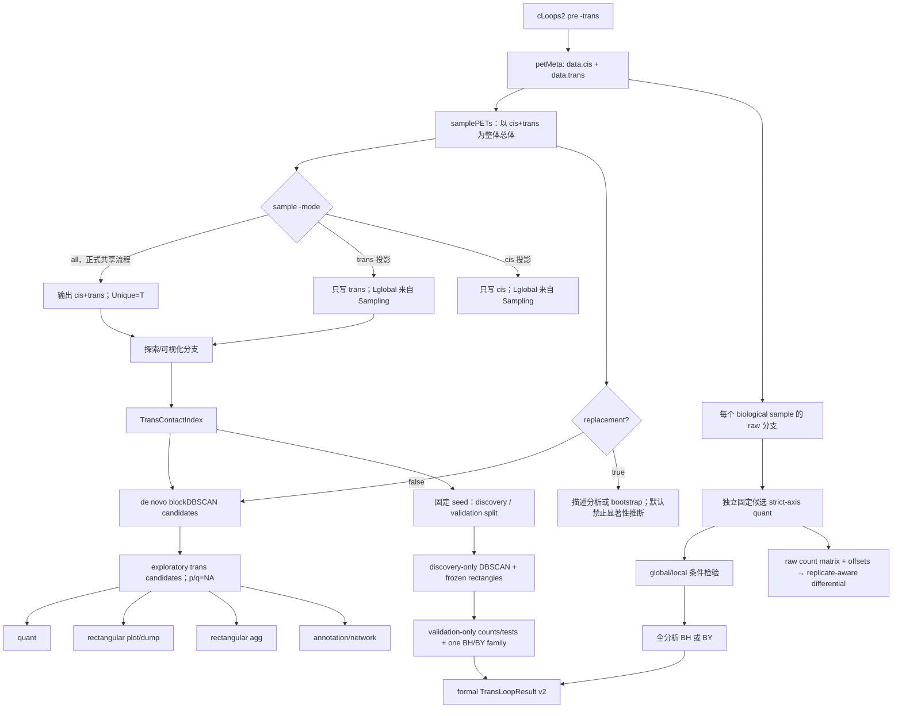

# cLoops2 跨染色体 PET 全链适配方案 v0.3

> 状态：两轮独立审核后的契约与 Phase 0–3 实现说明；保留统计能力边界
> 基线：当前仓库主源码目录 `cLoops2/`
> 日期：2026-07-16

## Executive Summary

当前 cLoops2 虽然可以通过 `cLoops2 pre -trans` 保留跨染色体 PET，也包含一个 `callTransLoops` 实现，但还不能认为下游已经正确支持 trans。问题并不只是 CLI 缺少 `-mode`：当前 trans 显著性统计复用了 cis 的无方向查询，把 `.ixy` 的 X/Y 两列当作同一染色体的可交换端点；通用 loop parser 又会因为 trans loop 的 `distance=-1` 在默认 `cut=0` 下将其静默过滤；矩阵、聚合、绘图和差异分析中也普遍存在方阵、对称化和 genomic-distance 假设。

推荐的总体方向是：

1. 将每个 trans `.ixy` 明确定义为 `chromX endpoints × chromY endpoints` 的有方向双部接触矩阵。
2. 新增 trans 专用的轴向查询与非对称矩形矩阵基础层，不修改现有 cis `XY` 语义。
3. 严格区分三个分母：染色体对内 PET 数 `Npair`、整体有效文库深度 `Lglobal`、输出目录物理行数 `Unique PETs`。
4. 保留 `blockDBSCAN` 作为候选生成器，但重写候选后的方向性计数、全局/局部条件检验和多重校正。
5. `callTransLoops → quant/plot/dump → agg/viewpoint/montage → annotation/filter → differential` 已形成方向一致的配套链；cis-only 算法仍明确拒绝 trans。
6. downsample 与 upsample 都保留，并由 `-tot` 相对逻辑文库深度的位置自动决定；有放回 upsample 不增加独立实验信息，描述性下游可以使用，正式 `callLoops/callDiffLoops` 推断必须拒绝。

推荐的正式共享数据流程是：

```text
cLoops2 pre -trans
→ samplePETs -mode all -tot T -seed S
→ callLoops -mode all
→ cis 与 trans 各自进入适合其数据结构的下游分支
```

`mode=trans` 应定位为整体抽样结果的 trans 投影，而不是“把 trans 自身抽到 `-tot`”。

## 0. v0.2 约束性决策

本节记录两轮独立审核后的最终实施契约。后文中的历史方案若与本节冲突，以本节为准。

### 0.1 Sampling：CLI 简单，内部语义完整

用户接口保留：

```text
samplePETs -d INPUT -o OUTPUT -tot T \
  [-mode {cis,trans,all}] [-seed INT] [-p CPU]
```

- `-mode` 只表示 emit，即把同一个整体样本中的哪些类别写出；默认 `cis`，保持旧输出类别兼容。
- logical universe 由输入 metadata validator 推导，普通完整输入是其全部 retained categories；CLI 不允许随意把 universe 改为 trans。
- 内部 planner 和 metadata 必须分别记录 `universe` 与 `emit`，避免把“整体的 trans 投影”误解成“以 trans 自身为总体”。
- `T < logical total` 自动无放回 downsample；`T == logical total` 为 identity；`T > logical total` 自动有放回 upsample。是否 replacement 不需要额外 CLI 授权。
- root/all 输入可以自动 upsample；可信 projection 输入在一期支持同类别 nested downsample，projection upsample 延后。
- `Unique PETs` 永远是物理输出行数；`Lglobal` 是经 validator 证明的 logical target depth。

可信 trans/cis projection 的父 logical depth 为 `T1`、当前类别物理行为 `K1` 时，继续下采样至 `T2<T1`：

\[
K_2\sim Hypergeom(K_1,T_1-K_1,T_2)
\]

再从现有 `K1` 行中均匀无放回抽 `K2` 行。这严格等价于从父完整 `T1` 样本继续抽取均匀 `T2` 子集后再取同类别投影，不需要未写出的另一类别实体行；多级 nested downsample 仍成立。父链中一旦出现 replacement，`replacement_ever=true` 永久继承。

### 0.2 Metadata：结构化验证而不是裸整数

不使用未经验证便返回整数的 `getEffectiveLibrarySize(meta)` 作为核心接口。基础层返回 `LibraryContext`：

```text
physical_total
logical_total | unavailable
retained_categories
emit
source_kind = root | all_sample | projection
replacement_this_step
replacement_ever
validity = valid | legacy_root_assumed | unknown | invalid
capabilities
reasons
```

Sampling v0.2 的 MUST 字段包括：schema、source/target logical depth、universe、emit、direction、seed/RNG 算法、replacement 状态，以及逐 record 的稳定 ID、category、`chromX/chromY`、path、source/selected/written rows、shape 和 dtype。完整文件 hash、完整 transform DAG 和 source-row lineage 是 OPTIONAL，不阻塞一期。

metadata 必须显式保存 `chromX/chromY`；为了兼容现有模块，一期不批量重命名安全的旧 `.ixy`。不能被旧 basename 安全、唯一表达的 chromosome 名称应 fail-fast，而不是继续依赖 `split("-")` 猜测。

### 0.3 Caller：探索性发现与正式检验分轨

一期不把“全数据 DBSCAN 后在同一数据上计算 p-value”称为正式 FDR 推断：

```text
de novo blockDBSCAN
→ exploratory candidates
→ strict-axis counts/effect sizes
→ adjustedP/significant = NA
```

一期正式检验使用独立固定候选：

```text
independent fixed rectangles
→ strict-axis global/local conditional tests
→ analysis-wide BH（默认）或 BY（可选）
→ versioned TransLoopResult
```

候选必须独立于当前 X–Y pairing；所有候选（包括 `rab=0`）进入同一分析家族，不能用当前检验数据的 `minPts/ES` 预删或在校正后再筛选并继续宣称 FDR 受控。discovery/validation split 和完整 Y-end permutation 是后续增强，不阻塞一期。

v0.3 进一步实现了可复现的 discovery/validation split：对每个稳定
`record_id`，由 `split_seed + SHA256(record_id)` 派生独立 RNG，将固定数目
的行分成互斥且并集等于源行的 discovery/validation 两组。DBSCAN 和矩形
边界只看 discovery；`Npair/ra/rb/rab`、global/local p-value 与全家族
BH/BY 只看 validation。其条件于 discovery 数据消除了“同一 PET 先选候选
再检验”的选择偏差，但有效深度下降会降低功效。sidecar 记录 seed、比例、
各 pair 行数闭合以及两组行号摘要。完整 pipeline permutation 仍是后续校准
选项，不是当前默认。

分析开始前固定 `test_scope={both,global}`。`both` 的 primary p-value 为：

\[
p_{primary}=\max(p_{global},p_{local})
\]

它检验“同时相对 global 和 local 富集”。local 不可用时，`both` 模式必须令 `pLocal=pPrimary=1` 并记录原因，不能静默回退 global；需要 global-only 时必须预先选择 `test_scope=global`。

### 0.4 O/E、矩阵与 differential estimand

O/E 必须明确区分：

\[
E^{pair}_{ij}=R^{pair}_iC^{pair}_j/N_{pair}
\]

和：

\[
E^{window}_{ij}=R^{window}_iC^{window}_j/N_{rect}
\]

前者回答相对整条 chromosome pair 边际的富集，后者回答相对当前局部窗口边际的富集。局部小矩阵可以使用有 `max_dense_cells` 保护的 dense histogram；全 chromosome-pair 优先使用逐 pair sparse COO/CSR，绝不镜像。当前一期 COO 仍会加载单个 pair 并构造与非零 bin 数量相关的数组，因此准确表述是“避免全库合并和 dense 方阵”，不是完整 chunk-streaming。

differential inference 使用每个 biological sample 的原始 counts 和 offsets，不使用 downsampled 或 pooled counts。等深度 sampling 只用于候选发现、可视化和描述性横向比较。当前 Snakemake 已保留 per-sample pre 目录，因此新增并行 raw-quant 分支即可，不需要推倒整个 DAG。

### 0.5 Replacement 的能力边界

| 使用场景 | `replacement_ever=true` |
|---|---|
| raw dump、plot | 允许并展示 provenance |
| descriptive quant/agg/viewpoint | 允许，p/q/significant 为 `NA` |
| exploratory clustering | 允许，但只报告候选和效应量 |
| fixed-candidate formal test | 拒绝 |
| differential inference | 拒绝 |
| bootstrap stability | 允许多个 seed；最终正式计数回到未 replacement source |

不提供能正常输出正式 p/q 的 replacement override。若调试接口强制继续，必须写 `inferentialValidity=false` 且所有 p/q/significant 为 `NA`。

### 0.6 当前实现落点（2026-07-17）

本方案不是只保留为讨论稿；当前工作树已经把一期契约落实到主源码：

| 能力 | 实现位置 | 状态 |
|---|---|---|
| 整体采样、projection、seed/CPU 无关 RNG | `cLoops2/sampling.py`、`filter.py` | 已实现 |
| 物理/逻辑深度、replacement/transform validator | `cLoops2/metadata.py`、`io.py` | 已实现 |
| 严格 X/Y 轴向索引与 mode-aware parser | `cLoops2/ds.py`、`io.py` | 已实现 |
| 非镜像矩形矩阵 | `cLoops2/cmat.py` | 已实现 |
| exploratory/fixed-formal 双轨 trans caller | `callTransLoops.py`、`trans_stats.py` | 已实现 |
| strict-axis quant 与矩形 plot/dump | `quant.py`、`plot.py`、`dump.py` | 已实现 |
| `pre -trans → sample all → cis/trans caller` | `snakemake_core/` | 已实现最小分支 |
| split-validation de novo formal caller | `callTransLoops.py`、`trans_stats.py` | 已实现 |
| rectangular agg、viewpoint、montage | `trans_agg.py` | 已实现 |
| 双染色体 annotation/network、axis-aware filter | `ano.py`、`findTargets.py`、`filter.py` | 已实现 |
| raw per-sample trans differential、NB/QL export | `trans_diff.py`、`cLoops2.py` | 已实现 |
| sample-level trans differential DAG | `snakemake_core/` | 已实现（需独立固定候选） |

`tests/` 的 synthetic fixtures 覆盖精确总数、same-seed projection、CPU 无关性、identity/upsample、nested downsample、轴混淆反例、零分配 pair、formal family、parser、矩形矩阵、metadata 更新与 replacement guard。实现与本文冲突时必须先统一契约，不能让两套语义并存。

## 1. 范围与目标

### 1.1 本方案要实现的能力

- 上游没有保留 trans 时，现有 cis 分析结果保持不变。
- 上游使用 `pre -trans` 时，能够基于整体文库额度同时归一化 cis 与 trans。
- 正确调用、量化、绘制和聚合 trans loops。
- 对 trans loop 两端分别按各自染色体注释。
- 为差异 trans interaction 提供明确的计数矩阵、归一化 exposure 和 replicate-aware 扩展路径。
- 所有不适用于 trans 的算法明确报错，而不是静默输出空结果。

### 1.2 明确不做的事情

以下算法的定义本身依赖单条染色体的线性距离、对角线或对称方阵，不应通过简单增加 `-trans` 强行适配：

- TAD/domain calling、quantification 和 aggregation；
- genomic-distance estimation；
- compartments/eigenvector；
- triangle、arch 和 cis `aggTwoAnchors`；
- 原有同染色体 virtual4C；
- 将现有 peak caller 直接当作 trans loop caller。

如需跨染色体 viewpoint，应新增“双染色体 virtual viewpoint”，而不是复用 cis virtual4C。

## 2. 修改前基线中已核验的源码事实

本节保留为何必须改造的审计证据；其中“当前”指 v0.3 修改前的 master
基线。修复后的行为以第 0、6、8、9 节为准。

### 2.1 上游 `pre` 的 trans 契约

- `pre` 默认不保留 trans；显式 `-trans` 后才保留跨染色体 PET，CLI 定义见 [`cLoops2/cLoops2.py`](cLoops2/cLoops2.py#L322)，执行映射见 [`cLoops2/cLoops2.py`](cLoops2/cLoops2.py#L2950)。
- parser 会先统计 trans 原始记录，但默认模式随后跳过 trans，见 [`cLoops2/io.py`](cLoops2/io.py#L104) 和 [`cLoops2/io.py`](cLoops2/io.py#L213)。因此 `Total Trans PETs > 0` 并不代表 `data.trans` 非空。
- `Unique PETs` 是实际保留、去重并写入 `.ixy` 的行数之和；可抽样数量必须从实际 `.ixy.shape[0]` 统计，不能从 `Total Trans PETs` 推导。
- trans PET 会规范化 chromosome pair 的方向；对 `chromX-chromY.ixy`，第一列属于 `chromX`，第二列属于 `chromY`，见 [`cLoops2/ds.py`](cLoops2/ds.py#L81)。
- 使用 `pre -trans -c ...` 时，白名单必须同时包含 PET 两端染色体；只保留一个染色体通常不会留下 trans PET。

### 2.2 当前 trans 查询存在轴混淆

现有 [`XY.queryPeak()`](cLoops2/ds.py#L176) 将 X/Y 两列命中取并集；[`XY.queryLoop()`](cLoops2/ds.py#L192) 又对两个 anchor 的并集求交。该语义适用于同一染色体上端点可交换的 cis PET，不适用于有明确轴归属的 trans PET。

最小反例：

```text
X = [100, 1000]      # chromX
Y = [1000, 100]      # chromY

anchor A = chromX:90-110
anchor B = chromY:90-110
```

当前无方向查询会得到 `ra=2, rb=2, rab=2`；严格轴向查询应得到：

```text
X∈A：PET 0
Y∈B：PET 1
X∈A 且 Y∈B：0
```

当前 [`callTransLoops.py`](cLoops2/callTransLoops.py#L120) 的 `ra/rb/rab`、P2LL、anchor coverage 和局部背景均受到该问题影响。

### 2.3 通用 loop parser 会丢弃 trans

trans caller 将 `distance` 写成 `-1`，见 [`callTransLoops.py`](cLoops2/callTransLoops.py#L78)。但 [`parseTxt2Loops()`](cLoops2/io.py#L710) 在判定 cis/trans 之前先用默认 `cut=0` 过滤负 distance，因此下游 parser 会静默丢弃 trans loops。

### 2.4 当前矩阵是 cis 方阵

[`dict2mat()`](cLoops2/cmat.py#L65) 会同时写入 `(x,y)` 和 `(y,x)`，并且当前矩阵入口只接受一套 genomic start/end。这不适用于行属于 `chromX`、列属于 `chromY` 的矩形 trans contact map。

### 2.5 当前 trans caller 的其他问题

- `blockDBSCAN` 的二维候选空间本身可以用于固定 chromosome pair，但聚类标签只能作为候选，不能作为显著性证据。
- 当前所谓 `FDR` 是附近区域计数超过中心计数的比例，没有进行候选间多重校正，见 [`callTransLoops.py`](cLoops2/callTransLoops.py#L173)。
- 当前 binomial 模型把 `ra*rb` 当作独立 Bernoulli trials，该独立性缺乏依据。
- trans density 当前使用当前 chromosome pair 的 PET 数作为文库分母，导致不同 pair、不同样本间不可直接比较，见 [`callTransLoops.py`](cLoops2/callTransLoops.py#L185)。
- CLI 检查 `_trans_loop.txt`，实际输出是 `_trans_loops.txt`，见 [`cLoops2/cLoops2.py`](cLoops2/cLoops2.py#L3712) 和 [`cLoops2/callTransLoops.py`](cLoops2/callTransLoops.py#L271)。
- `filter` 参数当前没有实际生效。

## 3. 上游采样与下游的统一数据契约

### 3.1 `samplePETs` 的整体采样语义

定义：

```text
Ncis   = 输入 data.cis 中所有实际 .ixy 行数
Ntrans = 输入 data.trans 中所有实际 .ixy 行数
Nall   = Ncis + Ntrans
T      = -tot
```

`T` 始终是整体 retained library 的目标额度；`mode` 仅决定从同一个全局抽样结果中写出哪些类别。

实现内部将其表达为：

```text
universe = validator 推导出的全部 retained categories
emit     = CLI -mode
```

CLI 不直接暴露 `universe`。真正以 trans 自身为 universe、把 trans 精确抽到 `T` 的 trans-conditional 功能不属于本次整体归一化目标。

| mode | 全局抽样总体 | 实际写出 | 输出 `Unique PETs` | 整体有效深度 |
|---|---|---|---:|---:|
| `cis` | cis + trans | 全局样本的 cis 投影 | `Kcis` | `T` |
| `trans` | cis + trans | 全局样本的 trans 投影 | `Ktrans` | `T` |
| `all` | cis + trans | 全部全局样本 | `T` | `T` |

对于没有 trans 的普通 `pre` 输出，`Ntrans=0`，所以 `cis` 与 `all` 在数据内容上等价；默认仍建议使用 `cis`，以保持旧行为和用户意图清楚。

### 3.2 downsample、identity 和 upsample

- `T < Nall`：在全部文件之间顺序超几何分配，文件内无放回抽样。
- `T == Nall`：直接保留全部记录，不调用随机选择。
- `T > Nall`：按各文件实际行数比例进行全局 multinomial 分配，文件内有放回抽样。

对 downsample：

\[
K_{trans}\sim Hypergeometric(N_{trans},N_{cis},T)
\]

对 upsample：

\[
K_{trans}\sim Binomial(T,N_{trans}/N_{all})
\]

采样方向必须比较 `T` 和 `Nall`，不能比较 `T` 和 `Ntrans`。例如 `Nall=100M, Ntrans=10M, T=50M` 是整体 downsample，trans 输出期望约 5M，并不是 trans upsample。

### 3.3 三个分母必须分开

| 名称 | 定义 | 用途 |
|---|---|---|
| `Npair` | 当前 `chromX-chromY.ixy` 实际行数 | 染色体对内条件检验、边际 O/E |
| `Lglobal` | 本次整体归一化后代表的文库深度 | CPM、density、跨样本比较 |
| `Unique PETs` | 当前输出目录所有 `.ixy` 的物理行数 | 文件完整性和 metadata 重建 |

推荐新增统一 helper：

```python
ctx = validateLibraryContext(meta, actual_records)
ctx.require("global_normalization")
library_size = ctx.logical_total
```

validator 必须验证 Sampling 与当前物理输出闭合，不能盲目信任过期 provenance；薄包装只能在 `require()` 成功后返回整数。旧 trans-only 或 transform 目录若缺少可信 provenance，允许 raw count、`Npair`、pair O/E 和绘图，但 `Lglobal` 标记 unavailable，不能臆造 global CPM 或正式跨样本推断。

### 3.4 Sampling metadata

建议至少记录：

```json
{
  "Sampling": {
    "schema_version": 2,
    "universe": "retained_all",
    "emit": "trans",
    "source_kind": "projection",
    "seed": 123,
    "requested_seed": 123,
    "bit_generator": "PCG64",
    "algorithm_version": "whole-library-hypergeom-multinomial-v0.2",
    "direction": "downsample",
    "replacement_this_step": false,
    "replacement_ever": false,
    "source_logical_total": 100000000,
    "target_logical_total": 50000000,
    "selected_by_category": {"cis": 44999877, "trans": 5000123},
    "written_by_category": {"cis": 0, "trans": 5000123},
    "physical_output_total": 5000123,
    "records": [
      {
        "record_id": "trans:chr1-chr2",
        "category": "trans",
        "chromX": "chr1",
        "chromY": "chr2",
        "source_path": "/source/chr1-chr2.ixy",
        "output_path": "/output/chr1-chr2.ixy",
        "source_rows": 10000246,
        "selected_rows": 5000123,
        "written_rows": 5000123,
        "shape": [10000246, 2],
        "dtype": "int64"
      }
    ]
  }
}
```

顶层 `Unique PETs` 必须等于物理输出的实际行数，不能在 trans-only 目录中伪装成整体额度 `T`。

为了让下游区分“某 chromosome pair 在全局抽样中恰好分配到 0”和“上游从未保留该 pair”，逐文件 manifest 是 MUST，而不是可选增强：

```text
category、key、available rows、allocated rows、written rows
```

`cLoops2 update` 在 record、rows、shape、dtype 闭合时可保留 Sampling 并更新路径；物理计数改变时写入 unknown `Transformation`，不能把复制后的 root 重新认证为无 replacement。`combine` 只有在全部父目录完整 materialize、retention scope 一致且 replacement 历史已知时才恢复逻辑深度；projection combine 一律 unknown，不能把 `ΣKtrans` 冒充 `ΣLglobal`。即使 clean combine 可恢复 `Lglobal`，也固定 `formal_inference_eligible=false`，正式分支应使用 current multi-file `pre` 或 per-sample raw 输入。`filter` 现在写结构化 child Transformation、以过滤后物理行数作为新的描述 universe、继承 `replacement_ever`，并固定 formal capability 为 false。完整 content hash 可选，没有 hash 时如实记录 `integrity_level=structural`。

## 4. 基础数据结构

### 4.1 `TransContactIndex`

新增独立类型，不改变现有 cis `XY`：

```python
class TransContactIndex:
    def count_x(self, left, right):
        """只查询 chromX，即 .ixy 第一列。"""

    def count_y(self, left, right):
        """只查询 chromY，即 .ixy 第二列。"""

    def count_rect(self, x_left, x_right, y_left, y_right):
        """统计 X 落入 A 且 Y 落入 B 的 PET 数。"""

    def query_rect_ids(self, x_left, x_right, y_left, y_right):
        """返回严格轴向矩形中的 PET IDs。"""
```

推荐实现：

1. 分别维护 X/Y 的 stable argsort 和排序后坐标。
2. 一维范围查询使用 `numpy.searchsorted`。
3. 矩形查询先选择候选较少的一轴，再在另一轴的原始坐标数组上布尔过滤。
4. 不为每次查询创建完整 Python set，也不预先构造全染色体 dense matrix。

所有 trans caller、quant、filter、agg 和 differential 模块必须复用该实现。

### 4.2 canonical chromosome-pair orientation

- 内部始终使用 `(chromX, chromY)` tuple，不依赖对包含 `-` 的染色体名做不安全的字符串切分。
- 对外部 loop 文件，如果 chromosome pair 顺序与 `.ixy` 不一致，应同时交换 chromosome、anchor start/end 和所有轴向字段。
- metadata key、源文件 basename、实际路径和输出名必须做一致性与冲突校验。

染色体名称包含 `-` 时当前 basename 解析行为属于既有未指定行为；实施时应单独定义兼容策略。

### 4.3 mode-aware loop parser

推荐接口：

```python
parseTxt2Loops(path, cut=0, mcut=-1, mode="cis")
```

顺序必须是：

1. 读取两端 chromosome 和坐标；
2. 判定并 canonicalize cis/trans；
3. 仅对 cis 应用 `distance cut/mcut`；
4. trans 保留 `distance=-1` 或 `NA`；
5. 根据 `mode={cis,trans,all}` 选择返回记录。

默认 `mode=cis` 保持已有消费者行为；适配后的下游必须显式请求 trans 或 all。

### 4.4 非对称矩形矩阵

新增 primitive：

```python
getTransObsMat(
    mat,
    x_start,
    x_end,
    y_start,
    y_end,
    x_bin_size,
    y_bin_size,
)
```

矩阵定义：

```text
rows    = chromX bins
columns = chromY bins
```

实现可使用 `numpy.histogram2d` 或 sparse COO。不得：

- 写入转置镜像；
- 沿主对角线去除记录；
- 使用 `X-Y` 作为 genomic distance；
- 默认假设 X/Y 范围或 bin 数相同。

## 5. trans loop caller 推荐算法

### 5.1 候选生成

对每个固定 chromosome pair，在原始 `(X,Y)` bp 坐标空间继续使用 `blockDBSCAN`，其 Manhattan 距离为：

\[
d((x_1,y_1),(x_2,y_2))=|x_1-x_2|+|y_1-y_2|
\]

该几何对 trans 候选发现是合理的，但应明确它只是候选生成器。

必要修正：

- `Npair < minPts` 或空文件直接跳过；
- 使用 int64 坐标与 ID；
- chromosome-pair、参数组合和 cluster label 稳定排序；
- 候选为 `[minX,maxX] × [minY,maxY]`；
- interval length 使用至少为 1 的一致定义；
- 多组 `eps/minPts` 产生的重叠候选，在检验前确定性合并；
- stripe、anchor 宽度比和 `ra/rb` 比值作为 QC，而不是无条件 hard filter。

### 5.2 全局方向性条件检验

对候选 `A×B` 定义：

```text
Npair = 当前 chromosome pair 的实际 PET 数
ra    = count_x(A)
rb    = count_y(B)
rab   = count_rect(A, B)
```

构造严格的 2×2 表：

| | Y∈B | Y∉B |
|---|---:|---:|
| X∈A | `rab` | `ra-rab` |
| X∉A | `rb-rab` | `Npair-ra-rb+rab` |

在固定两轴边际、随机重配端点的零假设下：

\[
R_{AB}\sim Hypergeom(N_{pair},r_a,r_b)
\]

```python
p_global = hypergeom.sf(rab - 1, Npair, ra, rb)
expected_global = ra * rb / Npair
```

富集和带连续性修正的 odds ratio：

\[
ES_{global}=\frac{rab+c}{expected_{global}+c}
\]

\[
OR=\frac{(n_{11}+0.5)(n_{00}+0.5)}
         {(n_{10}+0.5)(n_{01}+0.5)}
\]

### 5.3 局部方向性条件检验

trans 没有可保持的同染色体 genomic distance，也没有特殊的 lower-left 方向，因此不建议继续使用当前 P2LL 作为核心指标。

分别沿两条染色体扩展 anchor：

```text
WX = chromX 上 A 的局部窗口
WY = chromY 上 B 的局部窗口
```

定义：

```text
Nloc   = count_rect(WX, WY)
ra_loc = count_rect(A, WY)
rb_loc = count_rect(WX, B)
rab    = count_rect(A, B)
```

```python
p_local = hypergeom.sf(rab - 1, Nloc, ra_loc, rb_loc)
expected_local = ra_loc * rb_loc / Nloc
```

这相当于在局部矩形中固定 X/Y 两端边际后检验中心矩形富集，可同时控制局部 X stripe 和 Y stripe。

二维 donut/shifted rectangles 仍可以输出为 QC：

```python
empirical_p = (1 + number_of_background_counts_ge_rab) / (
    1 + number_of_background_regions
)
```

但它不能未经候选间校正就命名为 FDR。

局部表退化、背景过少或边际覆盖等于 0/Nloc 时，记录 `localTestAvailable=false`。若预先选择 `test_scope=both`，令 `pLocal=pPrimary=1`；只有预先选择 `test_scope=global` 时才使用全局检验，不能在看到数据后回退并改变零假设。

### 5.4 合并证据与多重检验

如果显著 loop 必须同时相对全局和局部背景富集，使用保守 intersection-union 统计：

\[
p_{combined}=\max(p_{global},p_{local})
\]

该 primary p-value 只用于独立固定候选或独立 validation 候选。一次分析中预先选择一个 `test_scope`，将全部 chromosome pairs 的所有固定候选（包括 `rab=0`）作为同一个多重检验家族。默认输出 BH adjusted p，同时允许选择 BY；字段必须明确为 `bhAdjustedP/byAdjustedP`，不能无条件声称任意依赖下 FDR 已受控。

de novo DBSCAN 候选不输出 adjusted p 或 significant。正式固定候选也不能在同一检验数据上按 `rab/minPts/ES` 先删候选，或在校正后按这些字段取子集仍宣称原 FDR 保证。计数和效应量作为结果报告；minimum-effect 正式检验延后。

### 5.5 候选选择偏差

DBSCAN 候选和显著性统计来自同一批 PET，普通条件 p-value 对预先给定矩形是精确的，但对数据驱动挑选出的高密度矩形可能偏乐观。

一期提供两条明确分轨：

- 探索模式：全数据聚类 → 方向性计数和 effect size；可以输出命名为 `fixedRegionPvalue/conditionalTailScore` 的描述性尾概率，但 `selectionAdjusted=false`、`adjustedP=NA`、`significant=NA`。
- 正式模式：用户提供独立于当前 X–Y pairing 的固定候选 → 方向性 global/local 条件检验 → 分析级 BH/BY。

discovery/validation split 和对每个 chromosome pair 内 Y endpoints 的完整 pipeline permutation 是后续增强。permutation 若使用 maxT，主要控制 FWER；若要估计 FDR，需要另外定义 permutation FDP/q-value，不能把 maxT 直接称为 FDR。

### 5.6 输出 schema

保留通用坐标列，追加语义明确的字段：

```text
schemaVersion
candidateSource
inferenceMode
selectionAdjusted
inferentialValidity
pairPETs
libraryDepth
readsA
readsB
PETs
expectedGlobal
expectedLocal
globalEnrichment
localEnrichment
oddsRatio
globalConditionalPvalue
localConditionalPvalue
primaryPvalue
bhAdjustedP
byAdjustedP
localTestAvailable
significant
```

实现使用新的 `TransLoopResult`/schema v2；不要把新统计量静默写入旧的 `Loop.__slots__`、`poissonPvalue`、`binomialPvalue` 或伪 FDR 列。探索模式的 adjusted/significant 必须为 `NA`。

跨样本量化至少明确输出：

\[
RPM_{library}=10^6\frac{rab}{L_{global}}
\]

如需面积归一化，另设名称明确的：

\[
RPM/kb^2=\frac{10^6rab/L_{global}}
{(width_A/1000)(width_B/1000)}
\]

`Npair` 只用于 pair 内零假设，不能作为跨样本 density 的整体分母。

## 6. 下游模块适配方案

| 模块 | 当前主要障碍 | 推荐方案 | 优先级 |
|---|---|---|---:|
| `callTransLoops` | 轴混淆、局部背景和 FDR 不正确 | `TransContactIndex`、global/local conditional test、BH、Lglobal | P0 |
| `quant loops` | parser 丢 trans、只读 cis、无方向查询 | 按 loop 类型路由，trans 用矩形查询 | P0 |
| `plot` | 单染色体方阵和对称化 | 两套区间、非对称矩形 heatmap/scatter | P0 |
| `dump` | 多种格式显式过滤 trans | BEDPE/.hic/矩形 sparse matrix | P0 |
| `agg loops` | 只读 cis，pileup 使用无方向 query | A/B 独立分箱的矩形 pileup | P1 |
| `anaLoops` | parser 丢 trans且显式过滤 | 两端分染色体注释、跨染色体网络 | P1 |
| `filterPETs` | 只处理 cis、loop query 串轴 | axis-aware region/rectangle filter | P1 |
| `callDiffLoops` | 只读 cis、MANorm/Poisson 假设 | count matrix、offset、replicate-aware NB | P2 |
| `estSim` | cis 方阵/对称表示 | canonical trans bins 展平 | 可选 |
| domains/estDis/eigen | 算法定义为 cis | 明确拒绝 trans | 不适配 |

### 6.1 `quant loops`

- mixed loop 文件按 canonical `(chromX, chromY)` 和 cis/trans 类型路由。
- trans 使用 `count_x/count_y/count_rect`。
- 输出 `Npair/Lglobal/ra/rb/rab`、global/local expected、enrichment 和 RPM。
- cis 的 `cut/mcut` 保持不变；trans 忽略 genomic-distance cut。
- Sampling 记录某 pair 分配为 0 时量化为 0；上游从未保留该 pair 时应报缺失或明确标记 unavailable，二者不能混淆。

### 6.2 `agg loops`

对每个 loop：

1. 分别围绕 A/B anchor 扩展两套窗口；
2. 每条轴独立切成固定数量 bins；
3. 用二维 histogram/sparse matrix 得到固定形状的矩形；
4. 每个 loop 等权聚合。

建议输出：

- raw pileup；
- `M/Lglobal*1e6` 的 CPM pileup；
- 基于行、列边际外积的 O/E；
- chromX anchor 和 chromY anchor 两条独立 1D profile。

不得对 trans pileup 旋转、对称化或使用对角距离。

实现位于 `cLoops2/trans_agg.py`，CLI 为 `transAgg`。X/Y 可使用不同
bin size 和 flank bins，因此输出允许真正的矩形；每个 feature 先独立计算
observed 和自己的 pair/window expected，再做等 feature 聚合。expected=0
的 cell 是不可估而不是真实 O/E=0，使用 `NaN + valid mask/valid_counts`
传播，避免把“没有期望”伪装成 depletion。`max_dense_cells` 在分配矩阵前
检查；输入按 record 分组并一次只加载一个 pair。

### 6.3 `plot`、matrix dump 与 trans viewpoint

trans plot 需要两套区间：

```text
--x-chrom/--x-start/--x-end
--y-chrom/--y-start/--y-end
```

支持：

- observed rectangular heatmap；
- log2 O/E；
- Pearson residual；
- PET scatter；
- loop rectangle overlay；
- 两条染色体各自的 gene/bigWig annotation。

不支持 `-triu`、arch、domain、eigenvector 或 cis correlation。

trans viewpoint 定义为：

```text
选择 X 落入 chromX viewpoint 的 PET
→ 对这些 PET 的 Y 端在 chromY 上做 histogram
```

反向 viewpoint 同理。

实现分别暴露 `transViewpoint` 与 `transMontage`：viewpoint 的 `anchor_axis`
显式选择 X 或 Y，反向时交换角色而不交换数据列；pair O/E 用完整
`Npair`，window O/E 要求 anchor context 是 anchor 的严格超集并存在可辨识
背景。montage 接收两份 BED region 文件，生成 X-region × Y-region 非镜像
矩阵；同轴 region 不允许重叠，一个 PET 至多进入一个 cell。两者都写
JSON provenance，并有 `max_bins/max_dense_cells` 防护。

BED、BEDPE、`.hic` 可以表达 trans。`dump -mode trans|all` 已为
BED/BEDPE/WashU/UCSC 路由结构化 trans records；WashU/UCSC 双向记录会同时
交换 chromosome 与对应坐标，并使用 disk-backed coordinate sort，不能再只
交换数值列。trans 上 `cut/mcut` 被明确忽略，因为跨染色体 genomic distance
没有定义。

### 6.4 `callDiffLoops`

无 biological replicates 时，只提供探索性比较。两个样本可使用带整体 exposure 的条件 Poisson/binomial：

\[
Y_A\sim Pois(L_A\lambda),\quad Y_B\sim Pois(L_B\lambda)
\]

给定总计数 `n=Y_A+Y_B`：

\[
Y_A\mid n\sim Binomial\left(n,\frac{L_A}{L_A+L_B}\right)
\]

同时输出控制 pair 内两端边际后的：

\[
E_s=\frac{ra_srb_s}{Npair_s}
\]

至少报告 raw counts、global CPM、marginal O/E、log2 fold change 和 BH q-value，并明确无重复样本结果是探索性的。

有 biological replicates 时推荐：

\[
Y_{ls}\sim NB(\mu_{ls},\phi_l)
\]

\[
\log\mu_{ls}=\log L_s+\beta_{0l}+\beta_{1l}condition_s
\]

v0.3 已实现 `cLoops2 callDiffLoops -mode trans`。输入是固定候选文件和
`sample/condition/directory` sample sheet；每个 directory 必须是保留 trans、
retention scope 相同、无 replacement ancestry 的 raw biological sample。
候选在每个样本中以严格 X/Y 方向计数，并同时导出：

```text
raw rab counts
Npair
readsA / readsB
selected exposure
Lglobal and sample design
```

可预先选择三种不同 estimand：

| offset | (E_{ls}) | 回答的问题 |
|---|---:|---|
| `global` | (L_{global,s}) | 每个整体 retained-library PET 的候选 interaction rate 是否变化 |
| `pair` | (N_{pair,s}) | 在给定 chromosome-pair 总量后候选占比是否变化 |
| `marginal` | (ra_{ls}rb_{ls}/N_{pair,s}) | 在给定两端 endpoint marginals 后关联强度是否变化 |

这些 estimand 不能在输出后互换。pair/marginal exposure 为 0 时该候选-样本
不可估，Python baseline 标记非 biological，生成的 edgeR 脚本会 fail-fast，
不会用伪小 exposure 隐藏问题。

有重复时，内置 baseline 拟合：

\[
Y_{ls}\sim NB(\mu_{ls},\phi_l),\qquad
\log\mu_{ls}=\log E_{ls}+\beta_{0l}+\beta_{1l}condition_s
\]

逐 loop moment dispersion 向全体 positive dispersion 中位数收缩：

\[
\tilde\phi_l=
\frac{df_l\phi_l+d_0\phi_{common}}{df_l+d_0}
\]

再报告 condition coefficient 的 Wald p-value；至少每组两个 biological
sample 才允许 `biological_inference=true`。同时生成直接可运行的 edgeR
`estimateDisp → glmQLFit → glmQLFTest` 脚本，后者是推荐的正式 QL 路径。

每组只有一个样本时，exact conditional rate test 只量化技术抽样不确定性：
它会输出 p/padj 供探索，但固定 `biological_inference=false` 且
`significant=NA`。所有候选，包括双零候选，进入一次全分析 BH/BY；不按
当前 counts/effect size 预筛或事后筛后继续宣称原 FDR。NB/QL 始终使用 raw
sample counts，downsampled 或 pooled 目录只进入 discovery/visualization。

### 6.5 Annotation 与网络

- anchor A 只查询 `genes[chromX]`；anchor B 只查询 `genes[chromY]`。
- anchor stitching 必须按 chromosome 分开进行。
- node ID 必须包含 chromosome。
- network edge 可以跨染色体。
- trans distance 写 `NA/-1`，类型写 `interchromosomal`，不套用 cis 远近程分类。

`anaLoops -mode trans|all` 已按上述契约实现。网络节点身份包含 chromosome，
同名但不同染色体的基因不会合并；SIF 记录跨染色体 edge，额外 edge table
记录 supporting loop IDs。图是无向 interaction graph，不应解释为调控因果；
A/B 方向保存在 `loop2anchors`。`findTargets` 现在可沿跨染色体 edge 查找
promoter target。

### 6.6 `filterPETs`

- `filterPETs -peaks -mode trans|all` 分别按 `chromX/chromY` 查询两套
  chromosome-aware regions；any-end 保留任一轴命中的 PET。`-iv` 会保留
  不命中记录以及 region/loop 文件未引用的 chromosome pairs。
- any-end：`mask_x | mask_y`；both-end：`mask_x & mask_y`。
- loop filter：只匹配同一 canonical chromosome pair 的 `anchorA × anchorB` 矩形。
- singleton/KNN：当前实现仍保持 cis-only；不能因有 `-mode` 就宣称已定义
  trans singleton/KNN。未来如实现，应在每个 chromosome pair 的矩形
  product space 独立处理并另行校准参数。
- `filterPETs -loops -mode trans|all` 已实现 axis-aware rectangle filter；
  any-end 是 `mask_x | mask_y`，`-both` 是 `mask_x & mask_y`，反向书写的
  loop 会同步交换 pair 与 A/B。filter 输出建立 child Transformation，继承
  replacement ancestry，并固定 formal inference 不可用，防止 provenance
  洗白。

## 7. Upsampling 的推断边界

有放回 upsample 可以保留为 I/O 功能，但重复 PET 并不是新增独立实验观测。

| 下游类型 | `Sampling.replacement=true` 时的建议行为 |
|---|---|
| plot/dump | 允许，展示 provenance |
| descriptive quant | 允许，使用 `Lglobal` 并警告 |
| callLoops exploratory | 允许，但 p/q/significant 写 `NA` |
| fixed-candidate formal test | 拒绝 |
| callDiffLoops | 默认拒绝 |
| bootstrap stability | 允许使用多个 seed，但最终计数/显著性回到原始数据 |

直接把复制行当作独立 PET 会人为提高 cluster `minPts`、放大 `rab` 并降低 p-value。简单乘一个权重也无法恢复被重采样遗漏的原始记录或独立实验信息。

不提供能够产生常规 p/q 的正式推断 override。调试模式即使继续执行，也必须写 `inferentialValidity=false` 且 p/q/significant 为 `NA`。guard 必须检查当前操作和祖先 transform 的 `replacement_ever`，并放在共享 metadata validator/public API 层，而不只放在 CLI。

## 8. CLI 与 workflow 设计

### 8.1 统一 mode 语义

建议适配命令统一支持：

```text
-mode {cis,trans,all}
```

默认 `cis`。对 `callLoops` 的兼容映射：

```text
无 mode      → cis
旧 -trans    → all，并给 deprecated 提示
-mode trans  → 只运行 trans caller
-mode all    → cis + trans caller
```

请求 trans 而 `data.trans` 为空时，应非零退出并提示：

```text
cLoops2 pre 默认不保留 trans；请使用 pre -trans，
并确认 -c 白名单包含跨染色体 PET 的两端染色体。
```

### 8.2 推荐工作流



### 8.3 Snakemake

当前最小工作流已经实现：

- 结构化 `trans.enabled/retain_in_pre` 与 `normalization.emit/seed`；
- trans 开启时自动配对 `pre -trans` 和 `samplePETs -mode all`；
- 归一化目标使用各输入 retained overall `Unique PETs` 的组间最小值，不使用最小 trans 数；
- target 计算前核对 retained categories、`pre -trans`、whitelist 和 preprocessing cutoffs；
- cis caller 与 trans caller 拆成两个 rule；`caller_mode=exploratory` 跟踪
  `_trans_candidates.txt`，`caller_mode=split` 传固定 seed/fraction 并跟踪
  `_trans_loops.txt`。

v0.3 增加 sample-level trans differential DAG：从两个配置 group 的
biological replicate 名单生成 sample sheet，输入独立固定候选，直接量化各自
raw `pre -trans` 目录，并显式跟踪 counts、`Npair`、`readsA/B`、exposure、
结果和 edgeR QL 脚本。它不复用 pooled group 或 normalized group 作为
replicates。`trans.differential.candidates/candidate_source` 缺失时工作流在解析
阶段 fail-fast。trans agg/annotation 的通用 API/CLI 已完成；是否把每一种
可视化自动扩成项目专用 DAG 由配置决定，不改变统计主链。

### 8.4 v0.3 可执行流程

| 上游/目的 | 输入选择 | 正确路径 |
|---|---|---|
| `pre` 未加 `-trans` | 只有 cis 实体 | `samplePETs -mode cis` 或 `all`（内容相同），只运行 cis 下游 |
| 同深度 cis+trans 描述/发现 | 每个输入均 `pre -trans` 且 retention scope 一致 | `samplePETs -mode all`；不要把 trans 自身对齐到 `-tot` |
| de novo trans 正式 caller | 未 replacement 的完整/可信数据 | `callLoops -mode trans -trans_split -trans_split_seed S` |
| 外部候选正式 caller | pairing-independent fixed rectangles | `callLoops -mode trans -trans_candidates ...` |
| trans differential | raw biological sample 目录 + 独立固定候选 | `callDiffLoops -mode trans -samples ...`，不使用 normalized/pooled counts |
| upsample/replacement | 描述性模拟 | plot/dump/agg 可用；formal caller/differential 拒绝 |

典型 discovery/interpretation 链：

```bash
cLoops2 pre -f sample.bedpe.gz -o sample.raw -trans -c chr1,...,chrX
cLoops2 samplePETs -d sample.raw -o sample.all.T \
  -tot T -mode all -seed 123 -p 8
cLoops2 callLoops -d sample.all.T -o sample.split -mode trans \
  -eps 5000 -minPts 20 -trans_split -trans_split_seed 123
cLoops2 quant -d sample.all.T -loops sample.split_trans_loops.txt \
  -mode trans -o sample.quant
cLoops2 transAgg -d sample.all.T -loops sample.split_trans_loops.txt \
  -x_bs 5000 -y_bs 5000 -method pair_oe -plot -o sample.agg
cLoops2 anaLoops -loops sample.split_trans_loops.txt -mode trans \
  -gtf genes.gtf -net -o sample.annotation
```

典型 differential 链中，每个 biological sample 分别执行 `pre -trans`，
sample sheet 指向这些 raw 目录：

```bash
cLoops2 callDiffLoops -mode trans -samples samples.tsv \
  -trans_candidates independent_candidates.tsv \
  -trans_candidate_source "independent discovery cohort" \
  -reference control -contrast treatment -trans_method auto \
  -trans_offset global -trans_mtc BH -o control_vs_treatment
Rscript control_vs_treatment_trans_edgeR.R
```

内置 NB 是可复现的 Python baseline；有 biological replicates 时，生成的
edgeR QL 结果是推荐的主统计路径。R/edgeR 是否安装由运行环境决定，仓库不在
缺失 R 时伪造 QL 结果。

## 9. 分阶段实施状态

### Phase 0：数据契约与基础层

主要实现文件：

```text
cLoops2/ds.py
cLoops2/io.py
cLoops2/cmat.py
```

已完成：

1. `TransContactIndex`；
2. mode-aware loop parser；
3. rectangular matrix primitive；
4. `LibraryContext` validator 与 capability guard；
5. canonical chromosome-pair helper；
6. Sampling provenance 的验证、保留和失效规则；
7. replacement downstream guard。

### Phase 1：最小正确 trans 分析链

主要实现文件：

```text
cLoops2/callTransLoops.py
cLoops2/cLoops2.py
cLoops2/quant.py
cLoops2/plot.py
cLoops2/dump.py
```

已完成：

1. 修复 trans caller 全部轴向计数；
2. de novo exploratory caller（不输出正式 q/FDR）；
3. independent fixed-candidate global/local conditional tests 和分析级 BH/BY；
4. 修复 `_trans_loops.txt` 文件检查；
5. `callLoops -mode`；
6. trans loop quantification；
7. bounded rectangular plot；
8. BEDPE、`.hic` 和 streaming COO matrix dump。

Phase 1 已完成，因此可以正确调用、量化和查看 directional trans loops；
但 de novo full-data 模式仍明确是 exploratory，只有固定候选或 split-validation
模式有正式 p/padj。

### Phase 2：解释、聚合与筛选

主要实现文件：

```text
cLoops2/trans_agg.py
cLoops2/ano.py
cLoops2/findTargets.py
cLoops2/filter.py
```

已完成：

1. rectangular aggregate pileup；
2. 两端分染色体 annotation；
3. 跨染色体 network；
4. axis-aware filtering；
5. trans viewpoint；
6. 结构化 provenance、valid-cell mask 与 bounded plot/text exports。

### Phase 3：差异分析与正式工作流

主要实现文件：

```text
cLoops2/trans_diff.py
cLoops2/cLoops2.py
snakemake_core/Snakefile
snakemake_core/config.yaml
```

已完成：

1. 固定 candidate family 的逐 biological sample raw count matrix；
2. 无重复样本的探索性 conditional test；
3. replicate-aware NB/export workflow；
4. Snakemake trans outputs 和 downstream rules；
5. global/pair/marginal 三类 offset 与完整 axis marginal 导出；
6. replacement/retention scope preflight 与 synthetic integration tests。

仍属于后续科学增强而非“静默缺失”的项目：trans similarity representation、
完整 Y-end permutation/maxT、cross-fitting、真实 rearrangement benchmark、
condition-specific CNV/stripe covariates，以及正式 minimum-effect test。当前
代码没有把这些未完成项包装成已校准的默认保证。

## 10. 测试与验收标准

### 10.1 必须覆盖的测试

| 测试 | 构造 | 关键断言 |
|---|---|---|
| 轴混淆回归 | `X=[100,1000], Y=[1000,100]` | legacy `rab=2`，新实现 `rab=0` |
| parser | trans `distance=-1` | trans 被保留，cis distance cut 不变 |
| orientation | 交换外部 pair 顺序 | canonical 后 chromosome/坐标同步一致 |
| rectangular matrix | 人工 PET cell | shape 正确、无镜像复制 |
| exact quant | 人工 A×B | `Npair/ra/rb/rab` 与手算一致 |
| global test | 固定 2×2 表 | 与 `scipy.stats.hypergeom.sf` 一致 |
| local test | target + X/Y stripes | 四格表正确、无负数、退化可识别 |
| normalization | trans projection | density 使用 Sampling target，不用 Ktrans/Npair |
| projection identity | all/trans 同 seed | trans `.ixy` 内容和下游计数一致 |
| zero allocation | Sampling 记录 pair allocated=0 | 量化为 0，不误报上游缺失 |
| missing trans | 普通 pre 输入 | 清晰非零错误并提示 `pre -trans` |
| upsample guard | `replacement=true` | 描述命令警告，推断命令默认拒绝 |
| agg | 中心 spike-in | 聚合中心 cell 富集 |
| annotation | A/B 命中不同染色体基因 | 两端注释不串染色体 |
| differential | 零计数与不同 exposures | 无 `inf/nan`，offset 正确 |
| cis regression | 现有 cis fixture | cis 结果与基线一致 |
| workflow | tiny `pre -trans` 数据 | all 模式的 cis/trans 两条 DAG 都完成 |

### 10.2 科学验证

代码性质测试不足以证明 caller 阈值具有生物学可靠性，还应至少包括：

- chromosome-pair 内 Y-end permutation null；
- 人工 planted clusters 和 stripe confounders；
- 不同 trans 比例、不同文库深度的 normalization benchmark；
- biological replicates 的 reproducibility；
- 已知跨染色体 rearrangement 或高置信 interaction 数据；
- 与至少一个成熟矩阵型方法的定性/定量比较。

cLoops2 原论文主要描述和验证的是 cis 场景，新的 trans caller 不能未经独立 benchmark 就声称与论文中的 cis caller 具有相同统计保证：<https://academic.oup.com/nar/article/50/1/57/6470683>。

replicate-aware differential 设计可参考 diffHic 的 quasi-negative-binomial 与 offset 思路：<https://pmc.ncbi.nlm.nih.gov/articles/PMC4539688/>。

### 10.3 最小端到端验收

```text
pre -trans
→ samplePETs -mode all
→ callLoops -mode all
→ quant trans
→ rectangular plot/dump
```

v0.3 的工程验收再扩展为：

```text
split-validation caller
→ transAgg / transViewpoint / transMontage
→ anaLoops -mode trans + cross-chromosome network
→ filterPETs -loops -mode trans
→ raw biological sample count/exposure matrix
→ NB baseline + runnable edgeR QL script
```

“工程验收通过”不等于所有数据集上不存在 biology-specific bias；CNV、
mappability、broad trans blocks、batch 与 replicate heterogeneity 仍必须结合
实验设计和 benchmark 评估。

验收条件：

- `data.trans` 非空且对应实际 `.ixy`；
- `mode=all` 的 `Unique PETs == -tot`；
- trans projection 的 `Unique PETs == Ktrans`，但 `Lglobal == -tot`；
- caller/quant 的 `ra/rb/rab` 经过轴向人工验证；
- parser 不丢 `distance=-1` 的 trans loops；
- 矩阵为正确的 `chromX × chromY` 非对称矩形；
- downstream 不将 replacement rows 视作新增独立证据；
- cis 回归结果不变。

## 11. 风险、兼容性与未指定行为

### 11.1 兼容性原则

- 所有新 `mode` 默认 `cis`。
- 不改变现有 cis `XY` 和 cis matrix 语义。
- 旧 `callLoops -trans` 映射为 `mode=all`，并逐步 deprecate。
- `mode=all` 是 `pre -trans` 后最兼容的正式数据形态，因为它保留 cis/trans 且 `Unique PETs == Lglobal == -tot`。
- `mode=trans` 是专用投影，必须依赖 Sampling 恢复整体文库分母。
- `-tot` 自动决定 downsample/identity/upsample；自动 upsample 是数据生成能力，不等于正式推断能力。
- 可信投影支持 nested downsample；投影 upsample 延后。

### 11.2 主要风险

- DBSCAN 数据驱动选候选会造成选择偏差；BH 不能自动修复候选选择偏差，因此 de novo 输出一期只能是 exploratory。
- trans 数据通常更稀疏，discovery/validation split 会降低功效。
- upsample 会复制记录，不可解释为更高独立测序深度。
- `update/combine/filter` 可能让 Sampling provenance 失效；当前只对计数闭合的 update 和完整父输入 combine 建立结构化契约，未做内容 hash，因此同形状内容替换仍不可检测。
- 不同样本如果 `pre -trans` 或 chromosome whitelist 不一致，缺失 pair 不能安全解释为 0。
- trans 矩阵可非常大，必须优先 sparse/memory-mapped 设计。
- 外部 loop chromosome orientation、含 `-` 的 chromosome name 和旧输出 schema 的历史行为未指定；v0.2 通过结构化 metadata、旧安全 basename 兼容和不安全名称 fail-fast 固定一期契约。
- 同 seed 的可复现范围应限定为相同代码、NumPy/joblib 版本和候选文件顺序下加载后的数组内容，不承诺跨版本序列化字节完全一致。
- `pre -trans` 的 cis/trans unique 行数与 `Cis PETs Redundancy` 已拆分计算；旧 metadata 的历史定义不变。
- `combine -keep 0` 已修复为保留全部坐标 multiplicity；pooled/downsampled counts 仍不能替代 biological-sample raw counts 进入 replicate-aware inference。

## 12. 最终建议

不要把本次工作定义为“给每个下游命令增加 trans 开关”。正确的实施单元应是：

```text
整体采样与 metadata 契约
→ 有方向的 TransContactIndex
→ 非对称矩形矩阵
→ 方向性 trans caller
→ quant/plot/dump
→ agg/annotation/filter
→ replicate-aware differential/workflow
```

优先完成 Phase 0 和 Phase 1。最小可信一期链为：

```text
pre -trans
→ validated overall sampling（-tot 自动决定方向）
→ samplePETs -mode all
→ de novo exploratory trans candidates
→ independent fixed-candidate formal testing
→ strict-axis quant
→ bounded rectangular plot / BEDPE / sparse COO dump
```

当前实现中 de novo full-data 输出被明确命名为 `_trans_candidates.txt`；独立
固定候选或 held-out split-validation 才写 `_trans_loops.txt`。agg、viewpoint、
montage、annotation/network、axis-aware loop filtering 与 raw-sample
differential 已接入。这里的“全链支持”是指数据结构、轴方向、分母、provenance
和 CLI/DAG 能正确衔接，不是宣称任何未知实验 bias 已被自动消除，也不是把
exploratory DBSCAN 或单样本 exact test包装成 biological FDR guarantee。

## 13. 实现验证与可复现命令

当前 cLoops2 Python 3.8 环境没有 pytest，因此采用标准库 `unittest`；测试同样可被未来的 pytest 收集。最终实测命令为：

```bash
PYTHONDONTWRITEBYTECODE=1 MPLCONFIGDIR=/tmp/mpl-cloops2-final \
  /home/irenadler/miniconda3/envs/cLoops2/bin/python \
  -m unittest discover -s tests -v

/home/irenadler/miniconda3/envs/cLoops2/bin/python -m py_compile \
  cLoops2/filter.py cLoops2/sampling.py cLoops2/metadata.py \
  cLoops2/ds.py cLoops2/io.py cLoops2/cmat.py cLoops2/trans_stats.py \
  cLoops2/callTransLoops.py cLoops2/callCisLoops.py \
  cLoops2/callPeaks.py cLoops2/callDomains.py cLoops2/callDiffLoops.py \
  cLoops2/quant.py cLoops2/dump.py cLoops2/plot.py cLoops2/trans_agg.py \
  cLoops2/trans_diff.py cLoops2/ano.py cLoops2/findTargets.py \
  cLoops2/cLoops2.py

XDG_CACHE_HOME=/tmp/cloops2-snakemake-cache \
  /home/irenadler/miniconda3/envs/chipseq/bin/snakemake \
  -s snakemake_core/Snakefile \
  --configfile snakemake_core/config.yaml.example --list-rules
```

最终结果：134 项测试通过，所有 Python 主模块/测试 `py_compile` 通过；
新 trans caller/stats/aggregate/differential 模块在 cLoops2 Python 环境下
`pyright` 为 0 error；Snakemake 9.20.0 对默认配置和启用
split + differential 的覆盖配置均可解析。另在 `/tmp` 实际完成了：

```text
synthetic pre-like cis+trans input
→ samplePETs -mode all -tot 7 -seed 123
→ exploratory callLoops -mode trans
→ quant -mode trans
→ dump pair_oe rectangular matrix
→ plot window_oe rectangular heatmap
```

修改前基线与修改后验证脚本分别为：

```bash
python scripts/repro_samplepets_legacy_baseline.py \
  --root /tmp/samplepets-legacy --tot 9 --seed 123
python scripts/verify_samplepets_v02.py \
  --root /tmp/samplepets-v02 --tot 7 --mode all --seed 123
```

统一 patch 在最终交付时生成于仓库根目录
`cLoops2_trans_full_downstream.patch`；它包含 sampling v0.2 和 trans Phase
0–3 的主源码、测试、工作流与本文档，不包含 log、pycache、build/dist 等
运行产物。

安装与帮助检查：

```bash
python -m pip install -e .
python -m cLoops2.cLoops2 samplePETs -h
python -m cLoops2.cLoops2 callLoops -h
```

手工 metadata 验证：

```bash
jq '.["Unique PETs"]' outdir/petMeta.json
jq '.data.cis | length, .data.trans | length' outdir/petMeta.json
jq '.Sampling' outdir/petMeta.json
find outdir -name '*.ixy' | sort
```

预期 `mode=all` 时 `Unique PETs == -tot`；`mode=trans` 时 `data.trans` 非空且 `Unique PETs == Ktrans`，同时 `Sampling.target_logical_total == -tot`。同一输入、seed、代码和 NumPy/joblib 版本下，不同 CPU 数得到相同的已加载数组内容；不承诺跨 NumPy/joblib 版本的序列化字节完全一致。
